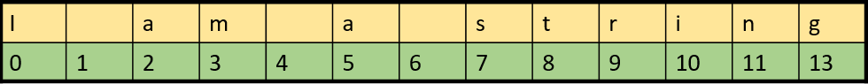

## Data Types

There are four essential kinds of Python data with different powers and capabilities:

*   **Strings** (Text)
*   **Integers** (Whole Numbers)
*   **Floats** (Decimal Numbers)
*   **Booleans** (True/False)

Take a look at the two examples below.\
What differences do you notice?

~~~
'Here is a some text'
~~~
{: .python}

~~~
42
~~~
{: .python}

You might be wondering…

Why is 'Here is some text' surrounded by quotation marks while 42 is not?\
Because these are two different “types” of Python data. We will look closer at the different types below.\
Note, that many Python editors and environments (such as Juptyter Lab etc.) will colour the output based on data type. E.g. in Jupyter Lab strings will be in red and integers in green.

<table class="colwidths-auto table" style="border:1px solid black">
<thead>
<tr class="row-odd">
<th class="head">
Data Type
</th>
<th class="head">
Explanation
</th>
<th class="head">
Example
</th>
</tr>
</thead>
<tbody>
<tr class="row-even">
<td>
String
</td>
<td>
Text
</td>
<td>
'Anything goes 4 strings!'
</td>
</tr>
<tr class="row-odd">
<td>
Integer
</td>
<td>
Whole Numbers
</td>
<td>
42
</td>
</tr>
<tr class="row-even">
<td>
Float
</td>
<td>
Decimal Numbers
</td>
<td>
3.1415926
</td>
</tr>
<tr class="row-odd">
<td>
Boolean
</td>
<td>
True/False
</td>
<td>
False
</td>
</tr>
</tbody>
</table>

## Check Data Types

You can check the data type of any value by using the function `type()`.

~~~
type('Here is some text')
~~~
{: .python}
~~~
str
~~~
{: .output}
The output `str` is short for string.
~~~
type(42)
~~~
{: .python}
~~~
int
~~~
{: .output}
The output `int` is short for integer.
## Strings

A _string_ is a Python data type that is treated like text, even if it contains a number. Strings are always enclosed by either single quotation marks `'this is a string'` or double quotation marks `"this is a string"`.

~~~
'this is a string'
~~~
{: .python}

~~~
"this is also a string, even though it contains a number like 42"
~~~
{: .python}

~~~
this is not a string
~~~
{: .python}

It doesn’t matter whether you use single or double quotation marks with strings, as long as you use the same kind on either side of the string.

<i>Bonus: Escape characters </i>  

> If you need to include a single or double quotation mark _inside_ of a string, then you need to either:
>
> *   use the opposite kind of quotation mark inside the string
> *   or “escape” the quotation mark by using a backslash `\` before it
>
> A backslash character `\` tells Python to treat the next character like a normal character and to ignore any special meaning.
{: .callout}

<!--~~~
"She exclaimed, 'This is a quotation inside a string!''"
~~~
{: .python}

~~~
"She exclaimed, \"This is also a quotation inside a string!\""
~~~
{: .python} -->

## String Methods

Each data type has different properties and capabilities. So there are special things that only strings can do, and there are special ways of interacting with strings.

For example, you can **index** and **slice** strings, you can **add** strings together.\
Here are a few examples:

### Index

Often in programming languages, individual items in an ordered set of data, can be accessed directly using a numeric index or key value. This process is referred to as indexing.

In Python, strings are ordered sequences of character data, and thus can be indexed in this way. Individual characters in a string can be accessed by specifying the string name followed by a number in square brackets `[]`. 

String indexing in Python is zero-based: the first character in the string has index 0, the next has index 1, and so on. The index of the last character will be the length of the string minus one. It can be illustrated like this: 

The individual characters can be accessed by index:

~~~
'I am a string'[0]
~~~
{: .python}
~~~
'I'
~~~
{: .output}

~~~
'I am a string'[7]
~~~
{: .python}
~~~
's'
~~~
{: .output}

### Slice

Python  allows a form of indexing syntax that extracts substrings from a string, known as string slicing.\
If `s` is a string, an expression of the form `s[start:stop]` returns the portion of `s` starting with position `start`, and up to ***but not including*** position `stop`:

~~~
'I am a string'[0:8]
~~~
{: .python}
~~~
'I am a s'
~~~
{: .output}

### Concatenation

The `+` operator concatenates strings. It returns a string consisting of the operands joined together, as shown here:

~~~
'I am a string' + ' and so am I'
~~~
{: .python}
~~~
'I am a string and so am I'
~~~
{: .output}

Notice that we have added a space in the beginning of the second string, otherwise there would be no space between ‘string’ and ‘and’. You can also add a space between two strings like this: 
~~~
'I am a string' + ' ' + 'and so am I' 
~~~
{: .python}
~~~
'I am a string and so am I'
~~~
{: .output}

<!--### Make uppercase

The method `upper()` returns a copy of the string with all alphabetic characters converted to uppercase:

~~~
'I am a string'.upper()
~~~
{: .python}
~~~
'I AM A STRING'
~~~
{: .output} -->

<!-- ## f-Strings

There is a special kind of string called an _f-string_.\
An f-string, short for formatted string literal, allows you to insert a variable directly into a string. [f-strings were introduced with Python version 3.6](https://docs.python.org/3/whatsnew/3.6.html#new-features).

An f-string must begin with an `f` outside the quotation marks. Then, inside the quotation marks, the inserted variable must be placed within curly brackets `{}`.

What does \\n mean?

\\n = new line

print(f"Beyonce burst out of the building and sang: \\n\\n'{lemonade\_snippet}'")

Beyonce burst out of the building and sang: 

'Hold up, they don't love you like I love you' -->

## Integers & Floats

An **integer** and a **float** are two Python data types for representing numbers.

*   Integers represent whole numbers.
*   Floats represent numbers with decimal points.

Integers and floats do not need to be placed in quotation marks.

~~~
type(42)
~~~
{: .python}
~~~
int
~~~
{: .output}

~~~
type(3.1415926)
~~~
{: .python}
~~~
float
~~~
{: .output}

### Mathematical operations
You can do a large range of mathematical calculations and operations with integers and floats. Here are a few examples, for an extended overview you can fold out a table at the end of this section. 

#### Multiplication
You can multiply in Python using the `*` operator
~~~
4 * 2
~~~
{: .python}
~~~
8
~~~
{: .output}

#### Exponents
You can use `**` as the exponent operator. An exponent is an expression of the number of times a number is muliplied by itself. 
~~~
4 ** 2
~~~
{: .python}
~~~
16
~~~
{: .output}

#### Modulus
The modulus or remainder operator looks like this: `a % b`. 
However, it does not work as a percentage although it might look like one. Instead it divides a with b and the remainder is returned. 
~~~
72 % 10
~~~
{: .python}
~~~
2
~~~
{: .output}
These are just a few of the mathmathical operations in Python - see the table below from Python’s documentation about [Built-in Types](https://docs.python.org/3/library/stdtypes.html).

<i>Click here to see more mathmathical operators</i>  

<table class="colwidths-auto table" style="border:1px solid black">
<thead>
<tr class="row-odd">
<th class="head">
Operation
</th>
<th class="head">
Explanation
</th>
</tr>
</thead>
<tbody>
<tr class="row-even">
<td>
<code class="docutils literal notranslate">x + y</code>
</td>
<td>
sum of <code class="docutils literal notranslate">x</code> and <code class="docutils literal notranslate">y</code>
</td>
</tr>
<tr class="row-odd">
<td>
<code class="docutils literal notranslate">x - y</code>
</td>
<td>
difference of <code class="docutils literal notranslate">x</code> and <code class="docutils literal notranslate">y</code>
</td>
</tr>
<tr class="row-even">
<td>
<code class="docutils literal notranslate">x * y</code>
</td>
<td>
product of <code class="docutils literal notranslate">x</code> and <code class="docutils literal notranslate">y</code>
</td>
</tr>
<tr class="row-odd">
<td>
<code class="docutils literal notranslate">x / y</code>
</td>
<td>
quotient of <code class="docutils literal notranslate">x</code> and <code class="docutils literal notranslate">y</code>
</td>
</tr>
<tr class="row-even">
<td>
<code class="docutils literal notranslate">x // y</code>
</td>
<td>
floored quotient of <code class="docutils literal notranslate">x</code> and <code class="docutils literal notranslate">y</code>
</td>
</tr>
<tr class="row-even">
<td>
<code class="docutils literal notranslate">x % y</code>
</td>
<td>
remainder of <code class="docutils literal notranslate">x</code> / <code class="docutils literal notranslate">y</code>
</td>
</tr>
<tr class="row-odd">
<td>
<code class="docutils literal notranslate">-x</code>
</td>
<td>
<code class="docutils literal notranslate">x</code> negated
</td>
</tr>
<tr class="row-even">
<td>
<code class="docutils literal notranslate">+x</code>
</td>
<td>
<code class="docutils literal notranslate">x</code> unchanged
</td>
</tr>
<tr class="row-odd">
<td>
<code class="docutils literal notranslate">abs(x)</code>
</td>
<td>
absolute value or magnitude of <code class="docutils literal notranslate">x</code>
</td>
</tr>
<tr class="row-even">
<td>
<code class="docutils literal notranslate">int(x)</code>
</td>
<td>
<code class="docutils literal notranslate">x</code> converted to integer
</td>
</tr>
<tr class="row-odd">
<td>
<code class="docutils literal notranslate">float(x)</code>
</td>
<td>
<code class="docutils literal notranslate">x</code> converted to floating point
</td>
</tr>
<tr class="row-even">
<td>
<code class="docutils literal notranslate">pow(x, y)</code>
</td>
<td>
<code class="docutils literal notranslate">x</code> to the power <code class="docutils literal notranslate">y</code>
</td>
</tr>
<tr class="row-odd">
<td>
<code class="docutils literal notranslate">x ** y</code>
</td>
<td>
<code class="docutils literal notranslate">x</code> to the power <code class="docutils literal notranslate">y</code>
</td>
</tr>
</tbody>
</table>

## Booleans
Booleans are “truth” values. They report on whether things in your Python universe are `True` or `False`. There are the only two options for a boolean: `True` or `False`. The boolean operators are **or**, **and**, and **not**. They are used to check if certain conditions are met before the program continues running. This is extremely helpful and even if it seems a bit confusing right now, it wil make sense later. Here are a few examples of using boolean logic. 

~~~
13 < 17
~~~
{: .python}
~~~
True
~~~
{: .output}
In this example above we state that 13 is less than 17 - which returns True because 13 is less than 17.
~~~
"hello" == "hi"
~~~
{: .python}
~~~
False
~~~
{: .output}
In the example above we state that 'hello' is equal to 'hi', which in the computers understanding it is not. 
~~~
666 == 777
~~~
{: .python}
~~~
False
~~~
{: .output}
In this example above we state that 666 is equal to 777, which it is not. Therefore, we get False as the output. 

These are the Boolean operations, ordered by ascending priority:
<table class="colwidths-auto table" style="border:1px solid black">
<thead>
<tr class="row-odd">
<th class="head">
Operation
</th>
<th class="head">
Result
</th>
</tr>
</thead>
<tbody>
<tr class="row-even">
<td>
<code>x or y</code>
</td>
<td>
if <i>x</i> is true, then <i>x</i>, else <i>y</i>
</td>
</tr>
<tr class="row-odd">
<td>
<code>x and y</code>
</td>
<td>
if <i>x</i> is false, then <i>x</i>, else <i>y</i>
</td>
</tr>
<tr class="row-even">
<td>
<code>not x</code>
</td>
<td>
if <i>x</i> is false, then <code>True</code>, else <code>False</code>
</td>
</tr>
</tbody>
</table>

## Comparisons
You can compare values in Python using different comparison operations. Comparisons are used to compare different values and objects in Python. Which we will learn much more about later. For now take a look at the comparisions and their meaning in the table underneath. 
##### This table summarizes the comparison operations:
<table class="colwidths-auto table" style="border:1px solid black">
<thead>
<tr class="row-odd">
<th class="head">
Comparison operation
</th>
<th class="head">
Explanation
</th>
</tr>
</thead>
<tbody>
<tr class="row-even">
<td>
<code>x < y</code>
</td>
<td>
True if x is less than y 
</td>
</tr>
<tr class="row-odd">
<td>
<code>x <= y</code>
</td>
<td>
True if x is less than or equal to y
</td>
</tr>
<tr class="row-even">
<td>
<code>x > y</code>
</td>
<td>
True if x is greater than y
</td>
</tr>
<tr class="row-odd">
<td>
<code>x >= y</code>
</td>
<td>
True if x is greater than or equal to y
</td>
</tr>
<tr class="row-even">
<td>
<code>x == y</code>
</td>
<td>
True if x is equal to y
</td>
</tr>
<tr class="row-odd">
<td>
<code>!=</code>
</td>
<td>
True if x is not equal to y
</td>
</tr>
</tbody>
</table>

> ## Notice the difference between a single equals sign `=` and a double equals sign `==`
> 
> *   A double equals sign `==` is used as the equals operator
> *   A single equals sign `=` is used for variable assignment (We will learn more about this in the lesson about variables)
{: .callout}

